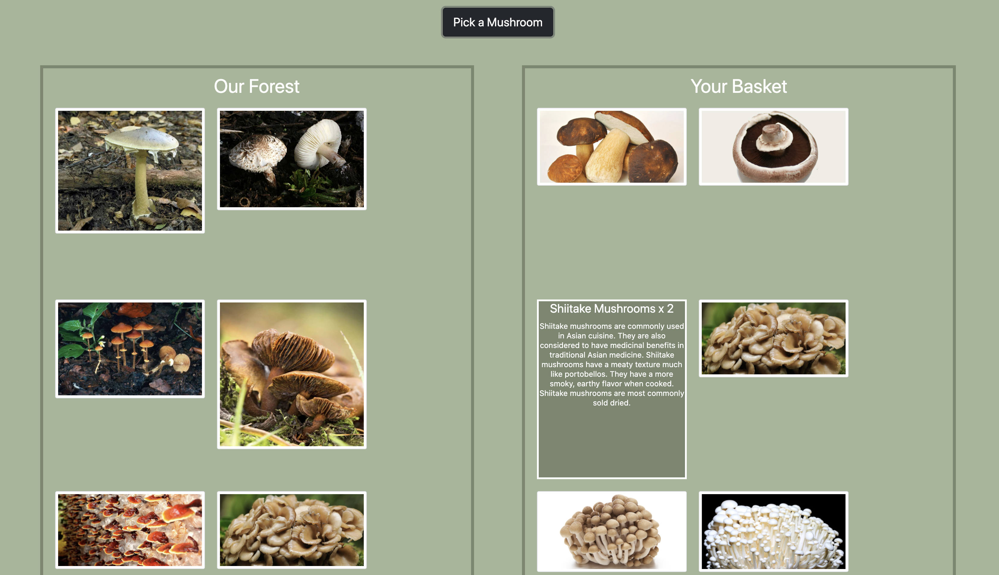
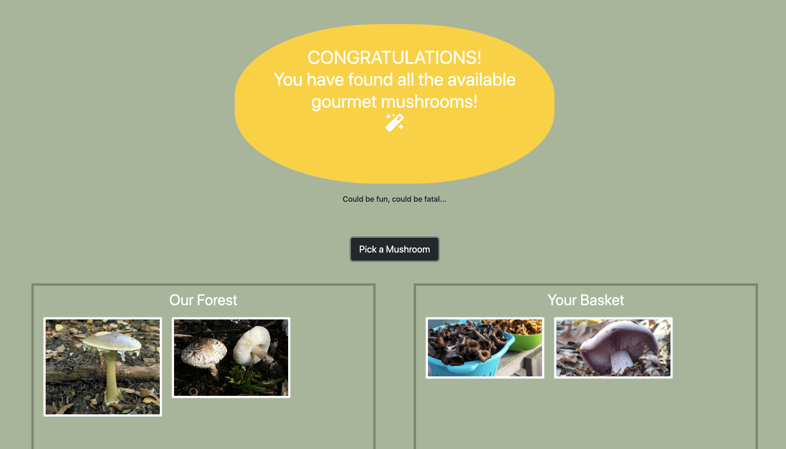
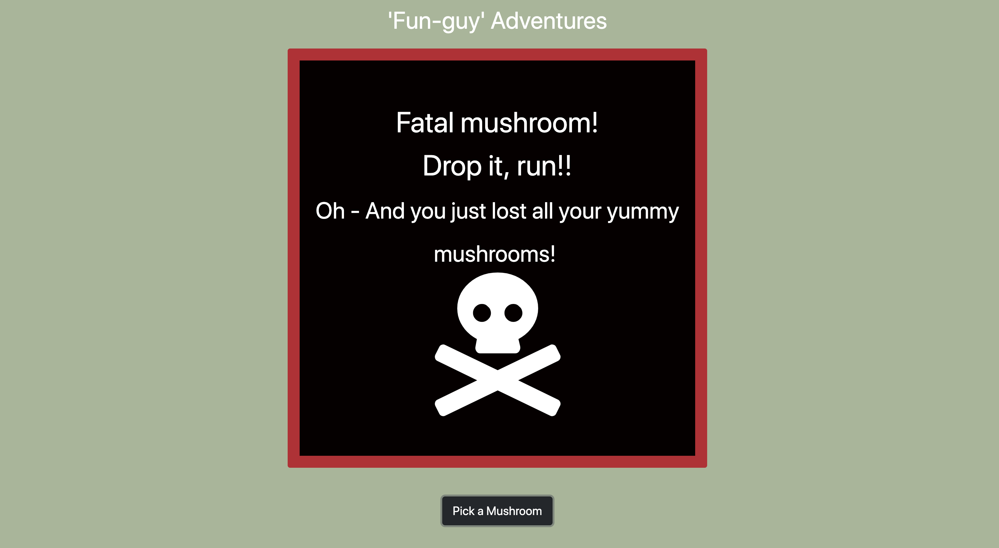
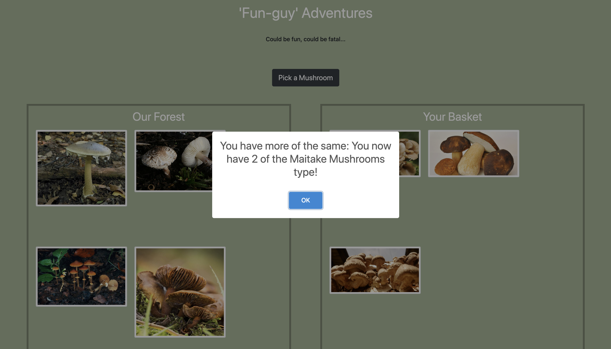

# Pick-Your-Own Mushroom Encounter
[MushroomPicker](https://mushroompicker-20347.web.app)

## Description
This was our first venture into React. Our Mushroom-Picker project was intended to give us the opportunity to familiarize ourselves with using state and props in React, understand how data gets transferred across files, and learn how to manipulate the display in the component files. 

## Background
Project instructions can be found [here](https://github.com/nss-nightclass-projects/exercise-vault/blob/master/REACT_mushroom_picker.md).

From really starting to grasp the concepts of state and props to learning how to pass data into individual components and how to make updates as well as how to control CSS based on React component attributes to having more fun with CSS in order to meet the project requirements for highlighting the deadly mushroom selection and the full basket scenarios, this project gave me the opportunity to both learn new concepts and practice current skills. 

## Technologies & Tools
Bootstrap, CSS, ES6 Modules, Github (for version control), HTML5, JavaScript, React, Sweetalert2 (for easily customizable pop-up alerts), Webpack

## Screenshots

###### Home Page (with Empty Basket)

###### Home Page (with Full Basket)

###### Mushroom Count for Mushrooms in Basket

###### Alert when User Gets a Full Basket

###### Alert when User Picks a Deadly Mushroom 

###### Alert when User Picks a Poisonous Mushroom

###### Alert when User Picks the Same Mushroom Again

## Features
1. User can see all the mushrooms available in the forest.
1. User can pick a mushroom, which adds a random mushroom to the user's basket. 
1. User can see the number of mushrooms for each type currently in their basket. 
1. User can see all the mushroom selected as they get added to his basket.
1. If the user happens to select a mushroom type that is already available in the basket, the count for that mushroom type gets increased by 1 and the user sees an alert about that change.
1. If the user picks a poisonous mushroom, the first two mushrooms in the basket get removed. If there's only one mushroom in the basket, then it gets removed. Otherwise, if the basket is empty, user just gets a warning that he happened upon a poisonous mushroom. 
1. If the user picks the deadly mushroom, then all the mushrooms in the basket get removed.
1. If a user picks a magic mushroom, then their basket gets filled instantaneously with one of each of the regular mushrooms (non-magic, non-poisonous, and non-deadly). 
1. When the user's basket has at least one of each of the regular mushrooms (non-magic, non-poisonous, and non-deadly), then they get a fun Congratulations! flashing animation. 
1. When the user picks the deadly mushroom and loses all the mushrooms currently in their basket, then they get a dreaded skull-and-bones animation. 

## How to Run
1. Clone down this repo.
1. Make sure you have http-server installed via npm. If not, get it [here](https://www.npmjs.com/package/http-server).
1. On your command line, run `hs -p 9999`.
1. In your browser, navigate to `http://localhost:9999`.

## Firebase Deployment
This project has been deployed with Firebase. You can find it here: https://mushroompicker-20347.web.app.
