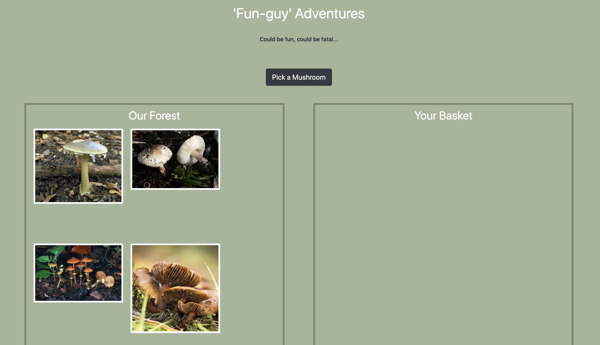
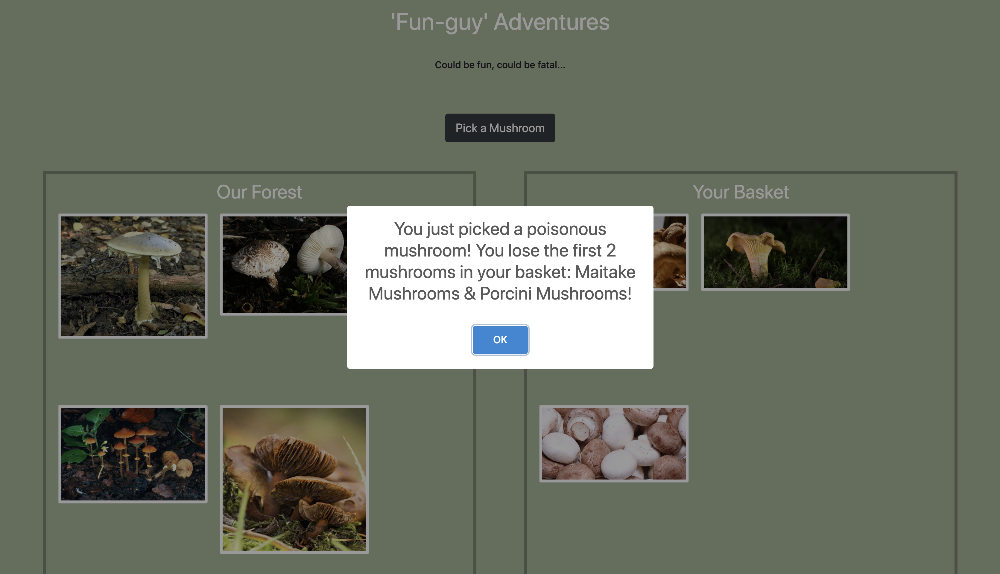

# Pick-Your-Own Mushroom Encounter

## Description
This was our first venture into React. Our Mushroom-Picker project was intended to give us the opportunity to familiarize ourselves with using state and props in React and understand how data gets transferred across files. 

## Background
Project instructions can be found [here](https://github.com/nss-nightclass-projects/exercise-vault/blob/master/REACT_mushroom_picker.md).

## Technologies & Tools
Bootstrap, CSS, ES6 Modules, Github (for version control), HTML, JavaScript (vanilla), React, Webpack

## Screenshots

###### Home Page (with Empty Basket)

###### Home Page (with Full Basket)

###### Alert when User Picks a Magic Mushroom

###### Alert when User Picks a Deadly Mushroom 

###### Alert when User Picks a Poisonous Mushroom

## Features
1. User can see all mushrooms available in the forest.
1. User can pick a mushroom, which adds a random mushroom to the user's basket. 
1. User can see the number of mushrooms for each type currently in their basket. 
1. If the user picks a poisonous mushroom, the first two mushrooms in the basket get removed. 
1. If the user picks a deadly mushroom, then all the mushrooms get removed
As a user, if I pick a magic mushroom (isMagic === true) then I should get one of each of the non magic, non poisonous, and non deadly mushrooms added to my basket
As a user, if my basket has one (or more) of each type of mushroom that is non poisonous or non deadly then I have collected them all and I should WIN.
As a user, if I WIN, something cool should happen.
As a user, if I pick a poisonous or deadly mushroom, something dark and scarry should happen

## How to Run
1. Clone down this repo.
1. Make sure you have http-server installed via npm. If not, get it [here](https://www.npmjs.com/package/http-server).
1. On your command line, run `hs -p 9999`.
1. In your browser, navigate to `http://localhost:9999`.
